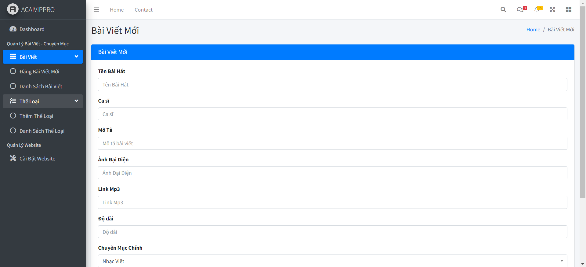
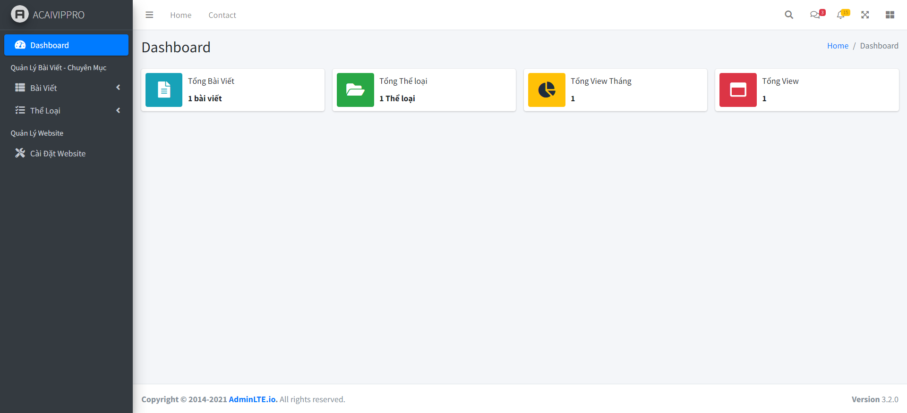

# code web nghe nhạc php
<h3>Code này ngẫu hứng mình viết chơi chơi, nên không được bài bản và đẹp.</h3> 
<b>Hướng Dẫn:</b> 
- sử dụng php 7.0 => 8.x 
- up data lên Mysql rồi config tại fille .env 
<b>Chức năng:</b> 
- đăng bài 
- sửa bài 
- thêm thể loại 
- sửa thể loại 
- setting website trên admin 
- sử dụng link ảnh banner bài hát và link mp3 sau khi post bài tự lưu lại về host trong thư mục uploads và mp3 
<h3>Demo</h3> 
Giao diện 

 
Giao diện nghe nhạc 

 
Giao diện Admin 

 
Giao diện Admin1 

 
